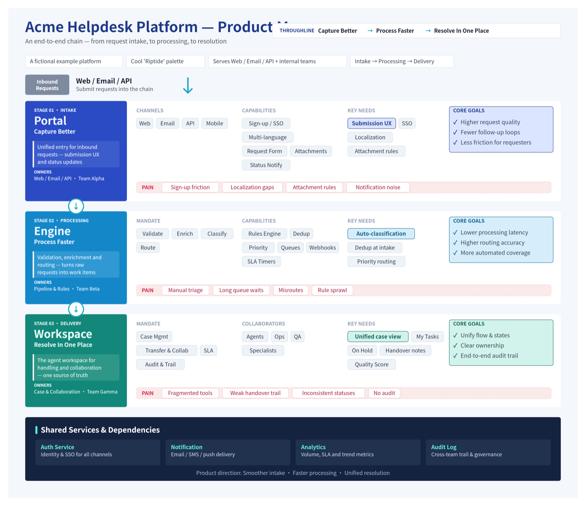
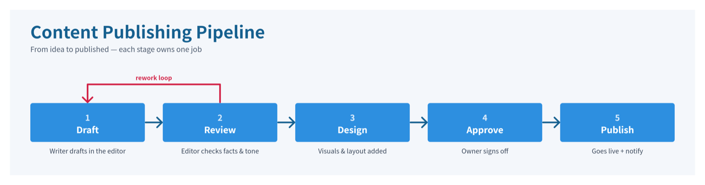
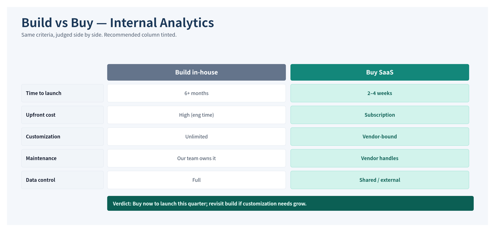
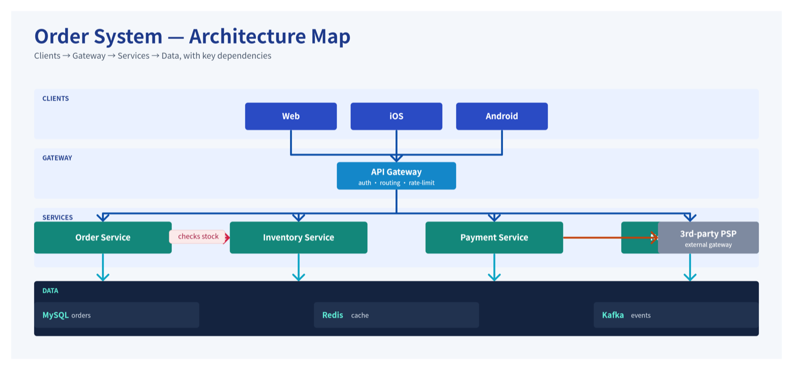
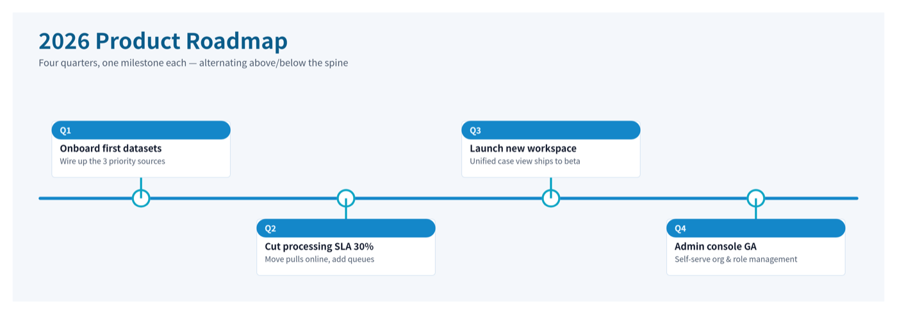
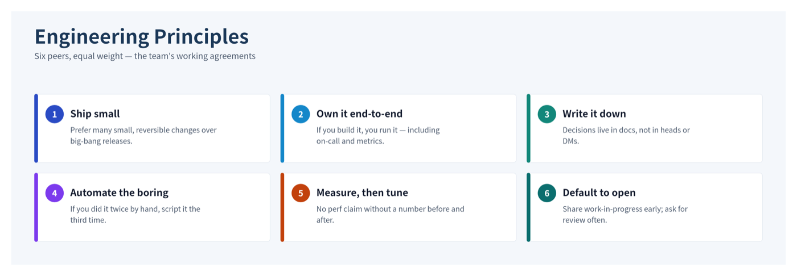

# feishu-whiteboard-pro

A **layout-first** skill for building polished, **editable** Feishu / Lark (飞书) whiteboards.

Most Feishu-board tools hand you a palette and the medium's rules, then leave the composition to
you — which is exactly where boards go wrong (sparse, lopsided, text clipping out of boxes). This
skill's center of gravity is the opposite: a **library of finished layout archetypes** with exact
coordinate recipes, driven by a **Python generator that does the layout math** (text measurement,
chip wrapping, auto-sizing containers) so the output is clean on the first or second render.

The board it produces is a real, editable, collaboratable Feishu whiteboard — not a screenshot.

## What's inside
```
feishu-whiteboard-pro/
├── SKILL.md                  # layout-first workflow + when-to-use
├── references/
│   ├── components.md         # the layout library: swimlane, comparison, pipeline,
│   │                         #   system map, timeline, card grid — each with a runnable recipe
│   ├── scenarios.md          # scenario → format + archetype map; long-image (长图),
│   │                         #   interleaved 图文混排 docs, and how to handle photos
│   ├── rules.md              # the medium's hard limits + build/verify commands
│   └── palettes.md           # curated solid palettes (flattened for the medium)
├── scripts/
│   ├── board.py              # the generator library — import it; it does the layout math
│   ├── render_check.sh       # render + geometric check in one call
│   └── preflight.sh          # dependency + auth check
└── examples/
    ├── product_map.py        # swimlane — a full worked board (fictional content)
    ├── pipeline.py           # pipeline — left→right flow with a rework loop
    ├── comparison.py         # comparison grid — options × criteria, the pick tinted
    ├── system_map.py         # system map — tiered architecture with connectors
    ├── timeline.py           # timeline — milestones alternating above/below a spine
    ├── card_grid.py          # card grid — equal-weight peers, no false hierarchy
    └── gallery/              # rendered previews of each archetype (below)
```

## Gallery
Six layout archetypes, each with a runnable example. Every preview below is generated by the
script next to it — no hand-tweaking — so you can reproduce it and edit the content to your own.
All content is fictional.

### Swimlane — `examples/product_map.py`
Lanes of owned work, read top-to-bottom. Best for product maps and team-of-teams overviews.


### Pipeline — `examples/pipeline.py`
A left→right flow where each stage owns one job; a colored connector shows a rework loop.


### Comparison grid — `examples/comparison.py`
Options judged on shared criteria, with the recommended column tinted and a verdict band.


### System map — `examples/system_map.py`
Tiered architecture (clients → gateway → services → data) wired with native connectors.


### Timeline — `examples/timeline.py`
Milestones on a spine, captions alternating above/below so they never collide.


### Card grid — `examples/card_grid.py`
Equal-weight peers in even tiles — for principles, values, or a flat set with no hierarchy.


## Quick start
```bash
# prerequisites: Node ≥ 20, lark-cli (npm i -g @larksuite/cli) authenticated, a Feishu/Lark account
bash scripts/preflight.sh

# build a board with the library
python3 examples/product_map.py            # writes /tmp/product_map.svg
bash scripts/render_check.sh /tmp/product_map.svg   # render to PNG + geometric check
```
Then push it into a Feishu doc as an editable whiteboard (see `SKILL.md` → workflow step 4).

## Install as a Claude skill
Copy this folder into your skills directory (e.g. `~/.claude/skills/feishu-whiteboard-pro`), or
point your agent at the packaged `.skill` file.

## The medium's honest ceiling
The Feishu board is a flat "rectangles, circles, lines and text" medium: **no gradients, no soft
shadows, no translucency, no sub-16px fine type** (see `references/rules.md`). This skill maximizes
beauty *within* the editable-board envelope — strong layout, balanced density, clean flat color. If
you need gradient/glass polish, that only exists as a static (non-editable) image.

## Credit
The verified medium rules and palette philosophy build on the open
[`beautiful-feishu-whiteboard`](https://github.com/zarazhangrui/beautiful-feishu-whiteboard) skill by
zarazhangrui. This project adds the missing **layout-component** layer, a **generator** that automates
the layout math, and a **scenario/format playbook** (long-image, interleaved docs).

## License
MIT — see [LICENSE](LICENSE).
